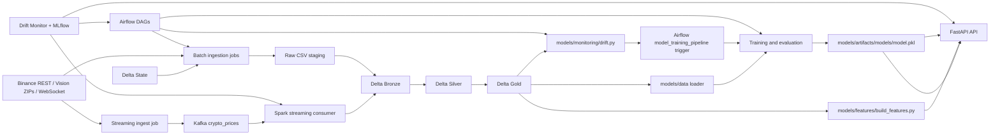

# CryptoQuant Architecture

CryptoQuant is a Binance market MLOps workspace built around batch backfills, live streaming ingestion, Spark + Delta Lake medallion tables, pandas-based model training, FastAPI serving, and lightweight drift-driven retraining.

## Architecture Tree



The batch path lands historical Binance candles in local CSV staging, then writes Bronze, Silver, and Gold Delta tables. The streaming path pushes live rows through Kafka and uses Spark Structured Streaming to write the same medallion layers. Training and serving both reuse the Gold feature contract. A separate monitoring loop scrapes service metrics, pushes micro-batch metrics, computes drift from Gold versus the training baseline, and can trigger retraining through Airflow when drift persists.

## File System Tree

The tree below is truncated to the directories and files that define the current implementation. Transient cache files are omitted.

```text
.
├── README.md  # project overview
├── docker-compose.yml  # local service stack
├── .env  # local environment values

├── airflow/  # orchestration
│   ├── README.md  # Airflow notes
│   └── dags/
│       ├── batch_data_pipeline.py  # batch DAG
│       ├── drift_monitor_pipeline.py  # drift monitor DAG
│       ├── model_training_pipeline.py  # training DAG
│       ├── predictions_pipeline.py  # prediction DAG
│       ├── stream_data_pipeline.py  # streaming management DAG
│       └── utils.py  # DAG helpers

├── api/  # prediction service
│   ├── README.md  # API notes
│   ├── app.py  # FastAPI app
│   └── schemas/
│       └── request.py  # request payload models

├── dashboard/  # monitoring dashboard
│   ├── app.py  # Streamlit app
│   ├── charts.py  # visualization components
│   ├── data_service.py  # data access layer
│   ├── delta_client.py  # Delta Lake interface
│   ├── mlflow_client.py  # MLflow interface
│   └── settings.py  # dashboard config
│
├── docker/  # container images
│   ├── airflow/  # Airflow image
│   ├── api/  # API image
│   ├── dashboard/  # Dashboard image
│   ├── kafka/  # Kafka init image
│   ├── spark/  # Spark image
│   └── stream-producer/  # Stream producer image

├── configs/  # runtime config
│   ├── README.md  # config notes
│   ├── data.yaml  # data paths and symbols
│   ├── kafka.yaml  # Kafka settings
│   ├── model.yaml  # model settings
│   └── spark.yaml  # Spark settings

├── delta/  # Delta Lake tables
│   ├── bronze/market/  # bronze market data
│   ├── gold/market/  # gold feature data
│   ├── predictions/log_return_lead1/  # prediction outputs
│   ├── raw_data/market/  # raw CSV staging
│   ├── silver/market/  # silver cleaned data
│   └── state/
│       ├── market_batch/  # incremental batch state
│       ├── market_stream/  # incremental stream state
│       └── monitoring/  # drift history and retraining state

├── docs/  # documentation
│   ├── architecture.md  # architecture doc
│   ├── commands.md  # run commands
│   └── data/
│       ├── binance.md  # Binance notes
│       └── storage.md  # storage notes

├── logs/  # Airflow logs
│   ├── dag_id=batch_data_pipeline/  # batch DAG logs
│   ├── dag_processor_manager/  # DAG parser logs
│   └── scheduler/  # scheduler logs

├── models/  # ML package
│   ├── README.md  # model notes
│   ├── artifacts/  # saved models and maps
│   ├── data/
│   │   ├── loader.py  # load training data
│   │   ├── splitter.py  # time split helper
│   │   └── validater.py  # data validation
│   ├── evaluation/
│   │   ├── backtesting.py  # backtest logic
│   │   ├── evaluate.py  # model evaluation
│   │   └── task_evaluators.py  # task-specific metrics
│   ├── features/
│   │   ├── build_features.py  # feature pipeline
│   │   └── feature_engineering.py  # feature logic
│   ├── inference/
│   │   ├── api_client.py  # API client for inference
│   │   ├── pipeline.py  # inference pipeline
│   │   └── realtime.py  # runtime predictor
│   ├── monitoring/
│   │   └── drift.py  # drift detection and retraining trigger
│   ├── registry/
│   │   ├── mlflow_registery.py  # MLflow logging
│   │   └── model_loader.py  # local model loader
│   ├── training/
│   │   ├── train.py  # train entrypoint
│   │   └── trainer.py  # model trainer
│   ├── utils/
│   │   └── horizon.py  # time horizon helpers
│   └── config_utils.py  # model config helpers

├── notebooks/  # exploration notebooks
│   ├── data_ingest.ipynb  # ingest notebook
│   └── model.ipynb  # model notebook

├── monitoring/  # platform monitoring assets (drift state under delta/state)

├── pipelines/  # data pipeline code
│   ├── ingestion/
│   │   ├── batch/  # historical and daily fetchers
│   │   └── streaming/  # Kafka producers and WS sources
│   ├── jobs/
│   │   ├── batch/  # Medallion (Bronze/Silver/Gold) batch and prediction jobs
│   │   └── streaming/  # Spark streaming jobs
│   ├── schema/  # Medallion and state schemas
│   ├── storage/  # Delta and local IO abstractions
│   ├── transformers/  # Medallion transformation logic
│   ├── utils/  # Spark and WS helpers
│   └── validation/  # Data quality rules

├── scripts/  # convenience launchers
│   ├── README.md  # script notes
│   └── run_api.sh  # API launcher

└── utils_global/  # shared helpers
    ├── config_loader.py  # YAML loader
    ├── logger.py  # logger helper
```

## Tech Stack

- Python 3.10+ for application code and pipelines.
- Apache Airflow 2.9.1 for orchestration.
- Apache Spark 3.5.0 for Medallion processing and streaming.
- Delta Lake (delta-spark, deltalake) for reliable storage.
- Apache Kafka 3.7.0 for real-time event transport.
- FastAPI & Pydantic for the prediction service.
- Streamlit for monitoring and research dashboard.
- MLflow for model tracking and registry.
- XGBoost & Scikit-learn for ML modelling.
- Docker & Docker Compose for local orchestration.

## Current Runtime State

- `delta/bronze/market/`, `delta/silver/market/`, and `delta/gold/market/` currently contain `_delta_log/` metadata and symbol partitions for `BTCUSDT` and `ETHUSDT`.
- `delta/predictions/log_return_lead1/` exists for model output tables.
- `delta/state/market/` and `delta/state/monitoring/` are used for incremental pipeline state and drift/retraining state.
- `delta/state/monitoring/drift_history/` stores the drift history Delta table.
- `logs/` contains DAG, scheduler, and processor-manager runtime logs.
- `data_platform/logs/` is present as the mounted log directory used by the Compose stack.
- The API is launched from `scripts/run_api.sh`, which sources the local virtual environment when available and runs `uvicorn api.app:app`.
- Drift history is stored in Delta under `delta/state/monitoring/drift_history/`.