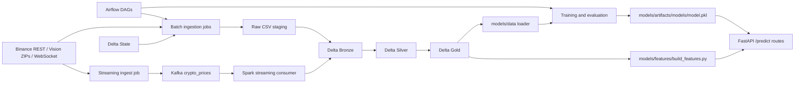

# CryptoQuant Architecture

CryptoQuant is a Binance market MLOps workspace built around batch backfills, live streaming ingestion, Spark + Delta Lake medallion tables, pandas/XGBoost model training, and FastAPI serving.

## Architecture Tree



The batch path lands historical Binance candles in local CSV staging, then writes Bronze, Silver, and Gold Delta tables. The streaming path pushes live rows through Kafka and uses Spark Structured Streaming to write the same medallion layers. Training and serving both reuse the Gold feature contract.

## File System Tree

The tree below is truncated to the directories and files that define the current implementation. Transient cache files are omitted.

```text
.
├── README.md  # project overview
├── docker-compose.yml  # local service stack
├── .env  # local environment values

├── airflow/  # orchestration
│   ├── README.md  # Airflow notes
│   └── dags/
│       ├── batch_data_pipeline.py  # batch DAG
│       └── model_training_pipeline.py  # training DAG

├── api/  # prediction service
│   ├── README.md  # API notes
│   ├── app.py  # FastAPI app
│   └── schemas/
│       ├── model.py  # shared Pydantic models
│       └── request.py  # request payload models

├── configs/  # runtime config
│   ├── README.md  # config notes
│   ├── data.yaml  # data paths and symbols
│   ├── kafka.yaml  # Kafka settings
│   ├── model.yaml  # model settings
│   └── spark.yaml  # Spark settings

├── data_platform/  # runtime logs mount
│   └── logs/  # container log target

├── delta/  # Delta Lake tables
│   ├── bronze/
│   │   └── market/  # bronze market data
│   ├── gold/
│   │   └── market/  # gold feature data
│   ├── raw_data/
│   │   └── market/  # raw CSV staging
│   ├── silver/
│   │   └── market/  # silver cleaned data
│   └── state/
│       └── market/  # incremental state

├── docker/  # container images
│   ├── airflow/
│   │   ├── Dockerfile  # Airflow image
|   |   ├── requirements.txt  # Airflow dependencies
│   │   └── entrypoint.sh  # Airflow entrypoint
│   └── spark/
│       ├── requirements.txt  # Spark dependencies
│       └── Dockerfile  # Spark image

├── docs/  # documentation
│   ├── architecture.md  # architecture doc
│   ├── commands.md  # run commands
│   └── data/
│       ├── binance.md  # Binance notes
│       └── storage.md  # storage notes

├── logs/  # Airflow logs
│   ├── dag_id=batch_data_pipeline/  # batch DAG logs
│   ├── dag_processor_manager/  # DAG parser logs
│   └── scheduler/  # scheduler logs

├── models/  # ML package
│   ├── README.md  # model notes
│   ├── artifacts/
│   │   └── models/  # saved models
│   ├── data/
│   │   ├── loader.py  # load training data
│   │   ├── schema.py  # validate data schema
│   │   └── splitter.py  # time split helper
│   ├── evaluation/
│   │   ├── backtesting.py  # backtest logic
│   │   ├── evaluate.py  # model evaluation
│   │   └── metrics.py  # metric helpers
│   ├── features/
│   │   └── build_features.py  # pandas features
│   ├── inference/
│   │   ├── pipeline.py  # inference pipeline
│   │   └── realtime.py  # runtime predictor
│   ├── registry/
│   │   ├── local_registry.py  # local artifact persistence
│   │   └── model_loader.py  # local model loader
│   ├── targets/  # target definitions
│   └── training/
│       ├── hyperparameter_tuning.py  # tuning helper
│       ├── train.py  # train entrypoint
│       └── trainer.py  # model trainer

├── notebooks/  # exploration notebooks
│   ├── data_ingest.ipynb  # ingest notebook
│   └── model.ipynb  # model notebook

├── pipelines/  # data pipeline code
│   ├── README.md  # pipeline notes
│   ├── ingestion/
│   │   ├── batch/
│   │   │   ├── jobs/
│   │   │   │   └── market/
│   │   │   │       ├── fetch_historical.py  # historical fetcher
│   │   │   │       └── fetch_today.py  # live-day fetcher
│   │   │   └── sources/
│   │   │       └── market/
│   │   │           ├── binance_historical.py  # Binance ZIP source
│   │   │           └── binance_today.py  # Binance daily source
│   │   └── streaming/
│   │       ├── producers/
│   │       │   └── kafka_producer.py  # Kafka producer
│   │       ├── sentiment/
│   │       │   ├── news_stream_job.py  # news producer job
│   │       │   ├── reddit_stream_job.py  # reddit producer job
│   │       │   ├── run_all.py  # sentiment orchestrator
│   │       │   └── youtube_stream_job.py  # youtube producer job
│   │       ├── sources/
│   │       │   ├── binance_source.py  # WebSocket source
│   │       │   └── websocket_client.py  # WS reconnect client
│   │       ├── spark/
│   │       │   └── spark_streaming.py  # Spark stream job
│   │       └── utils/
│   │           └── helpers.py  # Kafka parsing helper
│   ├── jobs/
│   │   └── batch/
│   │       ├── bronze.py  # bronze job
│   │       ├── cleanup_raw.py  # raw cleanup job
│   │       ├── gold.py  # gold job
│   │       ├── ingest.py  # ingest job
│   │       ├── silver.py  # silver job
│   │       └── utils.py  # batch helpers
│   │   └── streaming/
│   │       └── crypto_stream_job.py  # stream producer job
│   ├── schema/
│   │   ├── bronze/
│   │   │   └── market.py  # bronze schema
│   │   ├── gold/
│   │   │   └── market.py  # gold schema
│   │   ├── raw/
│   │   │   └── market.py  # raw schema
│   │   ├── silver/
│   │   │   └── market.py  # silver schema
│   │   ├── state/
│   │   │   └── market.py  # state schema
│   │   └── validation.py  # schema checks
│   ├── storage/
│   │   ├── delta/
│   │   │   ├── reader.py  # Delta reader
│   │   │   ├── utils.py  # Delta helpers
│   │   │   └── writer.py  # Delta writer
│   │   └── local/
│   │       └── csv.py  # CSV helper
│   ├── transformers/
│   │   ├── bronze/
│   │   │   └── market.py  # bronze transform
│   │   ├── gold/
│   │   │   └── market.py  # gold transform
│   │   ├── raw/
│   │   │   └── market.py  # raw transform
│   │   └── silver/
│   │       └── market.py  # silver transform
│   ├── utils/
│   │   └── spark.py  # Spark builder
│   └── validation/
│       └── validation.py  # validation rules

├── scripts/  # convenience launchers
│   ├── README.md  # script notes
│   └── run_api.sh  # API launcher

└── utils/  # shared helpers
    ├── config_loader.py  # YAML loader
    └── logger.py  # logger helper
```

## Tech Stack

- Python 3.10 for the application code, batch jobs, and Airflow workers.
- Apache Airflow 2.9.1 for orchestration of the batch medallion flow and training flow.
- Apache Spark 3.5.0 for local batch processing and Spark Structured Streaming.
- Delta Lake via `delta-spark` and `deltalake` for Bronze, Silver, Gold, and state tables.
- Apache Kafka 3.7.0 for live market event transport.
- FastAPI, Pydantic, and Uvicorn for the prediction API.
- Pandas and NumPy for model-side feature handling and inference preprocessing.
- XGBoost, scikit-learn, and joblib for training, evaluation, and artifact loading.
- websockets and requests for Binance live and historical ingestion.
- PyYAML for configuration loading from `configs/*.yaml`.
- PostgreSQL 15 with `psycopg2-binary` for the Airflow metadata database.
- Docker and Docker Compose for local service orchestration.

## Current Runtime State

- `delta/bronze/market/`, `delta/silver/market/`, and `delta/gold/market/` currently contain `_delta_log/` metadata and symbol partitions for `BTCUSDT` and `ETHUSDT`.
- `delta/state/market/` is currently empty.
- `logs/` contains DAG, scheduler, and processor-manager runtime logs.
- `data_platform/logs/` is present as the mounted log directory used by the Compose stack.
- The API is launched from `scripts/run_api.sh`, which sources the local virtual environment when available and runs `uvicorn api.app:app`.
