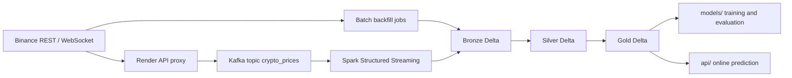

# CryptoQuant Architecture

CryptoQuant is a Binance market MLOps stack built around a medallion Delta Lake layout, Spark-based transforms, a lightweight model-training workflow, and two serving surfaces: a public WebSocket proxy and an internal FastAPI prediction API.

## System Overview

The design keeps batch and streaming feeds on the same medallion contract so the model layer and API layer can reuse the same feature definitions.

## Ingestion Paths

### Batch

The batch path starts from `scripts/run_batch.py`, which calls `pipelines/orchestration/batch_pipeline.py`.

1. `pipelines/ingestion/batch/jobs/market/backfill_historical.py` determines the last ingested candle per symbol.
2. `pipelines/ingestion/batch/sources/market/binance_historical.py` downloads the missing Binance vision ZIP files and returns pandas DataFrames.
3. `pipelines/transformers/bronze/market.py` converts the result into the Bronze Spark schema.
4. `pipelines/transformers/silver/market.py` cleans and standardizes the rows.
5. `pipelines/transformers/gold/market.py` generates the feature table.
6. `pipelines/storage/delta/writer.py` persists each layer using the configured Delta path and partitioning.

### Streaming

The streaming path is split into an upstream transport service and the Spark consumer.

1. `render_api/app/main.py` exposes WebSocket endpoints for backfill and live streaming.
2. `render_api/app/binance_ws.py` connects to Binance and emits closed kline events.
3. `pipelines/ingestion/streaming/jobs/crypto_stream_job.py` forwards the raw rows to Kafka through `pipelines/ingestion/streaming/producers/kafka_producer.py`.
4. `pipelines/ingestion/streaming/spark/spark_streaming.py` reads Kafka, parses the payload, and writes Bronze, Silver, and Gold micro-batches.
5. The Gold streaming transform recomputes lag and rolling features using recent Silver history so feature windows stay correct.

## Medallion Contract

- Bronze stores normalized raw candles with ingestion metadata.
- Silver stores cleaned market rows with type enforcement and business-rule filtering.
- Gold stores the feature-ready rows used by training and inference.
- Partitioning is centered on `symbol` and `date` to keep reads and writes predictable.

This contract should remain stable even if new exchanges, symbols, or horizons are added later.

## Model Lifecycle

The modeling layer lives in `models/`.

1. Curated market data is loaded into pandas for training.
2. The schema is validated before any fitting occurs.
3. Data is split in time order so the holdout reflects the market setting.
4. `models/training/trainer.py` fits the model using the configured feature columns.
5. `models/evaluation/evaluate.py` reports RMSE, directional accuracy, and a simple backtest result.
6. `models/registry/model_loader.py` loads the saved local artifact for serving.

The feature contract is defined in `models/config/model_config.py` and is shared by training, evaluation, inference, and the API.

## Serving Contracts

The API has two prediction modes.

- `/predict/base` accepts raw OHLCV rows and builds features internally before scoring.
- `/predict/engineered` accepts precomputed feature rows and scores them directly.

Both routes should receive pandas DataFrames before scoring. That keeps the HTTP layer thin and ensures feature engineering stays inside the model pipeline instead of being duplicated in request handlers.

## Configuration

- `configs/data.yaml` defines symbols, interval, historical backfill start date, Delta table paths, and the upstream WebSocket URI.
- `configs/spark.yaml` defines the local Spark session and Delta tuning.
- `configs/kafka.yaml` defines the broker aliases and topic settings used by streaming ingestion.

These files are the first place to update when a deployment target or data source changes.

## Current Implementation Notes

- `render_api/` is the upstream market-data proxy for the streaming path.
- `pipelines/transformers/` and `models/features/build_features.py` should stay aligned so batch training and online serving produce the same feature set.
- Delta writers support upserts keyed by `symbol` and `open_time`.
- The `medallion/` directory is the storage contract; keep code and docs aligned with it.

## Future Roadmap

- Add Airflow DAGs for scheduled backfills, retraining, drift checks, and model promotion.
- Expand the MLflow registry integration so model versions can be tracked and promoted explicitly.
- Add automated validation and monitoring for schema drift, data quality, and prediction quality.
- Move toward feature-store-like governance if multiple model families or horizons are introduced.
- Add more observability around streaming retries, Kafka lag, and Spark micro-batch health.
- Introduce CI coverage for the feature engineering and validation layers so contract drift is caught earlier.

CryptoQuant/
│
├── README.md
├── requirements.txt
├── docker-compose.yml
├── .env
├── .gitignore
│
├── configs/                  # central configs (VERY important)
│   ├── kafka.yaml
│   ├── spark.yaml
│   ├── airflow.yaml
│   └── model.yaml
│
├── datasets/                     # (optional local dev only)
│
├── pipelines/                # core data pipelines
│
├── medallion/               # data lake structure (Delta Lake)
│   ├── bronze/
│   │   ├── market/
│   │   └── articles/
│   ├── silver/
│   └── gold/
│
├── models/                  # ML logic
│
├── notebooks/              # experimentation (optional)
│   ├── eda.ipynb
│   └── experiments.ipynb
│
├── airflow/                # orchestration
│   ├── dags/
│   │   ├── training_dag.py
│   │   ├── retraining_dag.py
│   │   └── drift_dag.py
│   │
│   ├── plugins/
│   └── requirements.txt
│
├── api/                    # model serving
│   ├── app.py              # FastAPI entry
│   ├── routes/
│   │   ├── predict.py
│   │   └── health.py
│   │
│   ├── services/
│   │   ├── inference.py
│   │   └── model_loader.py
│   │
│   └── schemas/
│       └── request.py
│
├── monitoring/             # observability
│   ├── drift.py
│   ├── metrics.py
│   └── alerts.py
│
├── tests/                  # unit + integration tests
│   ├── test_pipeline.py
│   ├── test_model.py
│   └── test_api.py
│
├── scripts/                # utility scripts
│   ├── start_kafka.sh
│   ├── start_spark.sh
│   └── run_pipeline.sh
│
├── ci-cd/                  # CI/CD configs
│   └── github/
│       └── workflows/
│           └── ci.yml
│
└── docs/                   # documentation
    ├── architecture.md
    └── setup.md

## Models
models/
│
├── config/
│   └── model_config.py
│
├── data/
│   ├── loader.py          # read from Silver
│   └── schema.py          # expected columns
│
├── features/
│   ├── build_features.py      # feature engineering logic
│   └── scaling.py             # normalization / scaling
├── training/
│   ├── train.py
│   ├── trainer.py
│   └── hyperparameter_tuning.py
│
├── evaluation/
│   ├── evaluate.py
│   ├── backtesting.py
│   └── metrics.py
│
├── inference/
│   ├── realtime.py        # Kafka/Spark inference
│   └── pipeline.py
│
├── registry/
│   ├── mlflow_registry.py
│   └── model_loader.py
│
└── artifacts/
    ├── models/                # saved models
    └── scalers/

# Pipelines
pipelines/
│
├── ingestion/                      # DATA ENTRY POINTS
│   ├── batch/
│   │   ├── market.py              # batch crypto ingestion pipeline
│   │   ├── sentiment.py           # batch news/reddit ingestion
│   │   ├── fetch_coins.py         # Binance downloader (your code)
│   │   └── utils.py               # date utils, incremental logic
│   │
│   ├── streaming/
│
├── bronze/                        # RAW DATA WRITING LAYER
│   ├── market.py                 # write_to_bronze (your code)
│   ├── sentiment.py              # write sentiment data
│   ├── utils.py                  # merge helpers, partitioning
│   └── schema.py                 # MARKET_SCHEMA (important)
│
├── silver/                        # CLEANED + STANDARDIZED DATA
│   ├── market.py                 # cleaning, dedup, casting
│   ├── sentiment.py              # NLP cleaning
│   ├── joins.py                  # merge market + sentiment
│   └── utils.py                  # validation helpers
│
├── gold/                          # FEATURE ENGINEERING
│   ├── market_features.py        # returns, volatility, indicators
│   ├── sentiment_features.py     # sentiment scores aggregation
│   ├── feature_store.py          # final ML-ready dataset
│   └── utils.py
│
├── orchestration/                 # PIPELINE EXECUTION LOGIC
│   ├── batch_pipeline.py         # bronze → silver → gold (batch)
│   ├── streaming_pipeline.py     # streaming end-to-end
│   └── scheduler.py              # cron / airflow hooks
│
├── validation/                    # DATA QUALITY (VERY IMPORTANT)
│   ├── market.py                 # schema + null checks
│   ├── sentiment.py
│   └── expectations.py           # reusable rules
│
├── state/                         # INCREMENTAL STATE MANAGEMENT
│   ├── market_state.py           # last timestamp logic
│   └── state_store.py            # file/db abstraction
│
└── utils/                         # SHARED UTILITIES
    ├── logger.py
    ├── config_loader.py          # load YAML configs
    ├── spark.py                  # Spark session builder
    └── helpers.py

pipelines/ingestion/streaming/
│
├── sources/
│   ├── websocket_client.py
│   └── binance_source.py
│
├── producers/
│   └── kafka_producer.py
│
├── processors/
│   ├── validator.py
│   ├── transformer.py
│   └── enricher.py
│
├── jobs/
│   └── crypto_stream_job.py
│
└── spark/
    └── spark_streaming.py